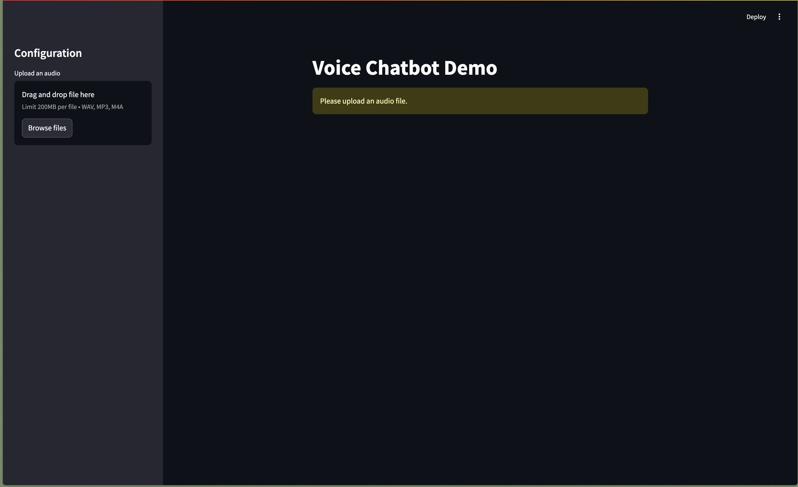
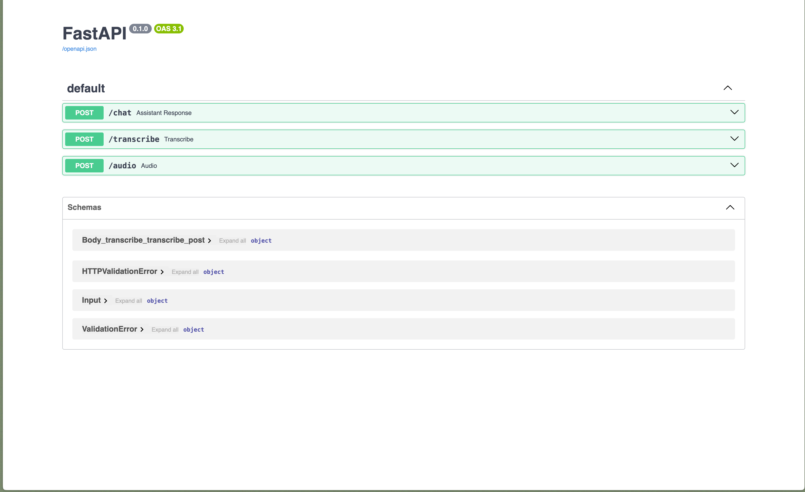
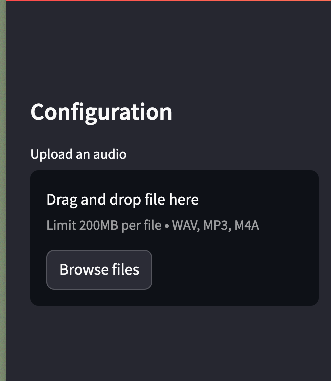
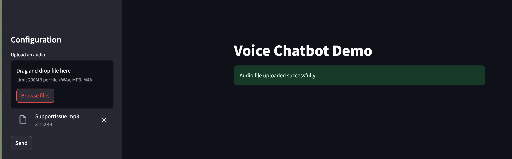

# voiceBot
An voice to voice demo support chatbot

## Frontend Setup Guide

- Create a virutal environment: cmd: [`python3 -m venv myenv`]
    1. Open your terminal.
    2. Navigate to the directory of github project.
    3. Run the following command to create a virtual environment, Here myenv is the environment name.
    4. Activate the env. cmd: [`source myenv/bin/activate`]
- In the root directory of the Frontend Project. cmd : [`pip install -r requirements.txt `]
- To run the application. cmd: [`streamlit run app.py`]
- The web application will be accessible at `https://localhost:8501/` 

## Backend Setup Guide 
- Create a virutal environment: cmd: [`python3 -m fastapi myenv`]
    1. Open your terminal.
    2. Navigate to the directory of github project.
    3. Run the following command to create a virtual environment, Here fastapi is the environment name.
    4. Activate the env. cmd: [`source fastapi/bin/activate`]
- In the root directory of the Backend Project. cmd : [`pip install -r requirements.txt `]
- Additionally run, cmd: [`pip install git+https://github.com/huggingface/parler-tts.git`] 
- To run the application. cmd: [`python server.py`]
- The swagger application will be accessible at `https://localhost:8501/` 

### To run the chatbot: 
- In the github project, dir Frontend/sampleAudio has two sample audio in mp3 format.
- For demo purpose, upload the audio in the sidebar by clicking on browse. 

- Once the audio is uploaded. Click on `send` button

- After clicking on send, the chatbot will transribe the audio, then generate text response, and finally generate voice response. 

--------

For any queries raise an issue or drop a mail at : vishwasrawat.work@gmail.com
